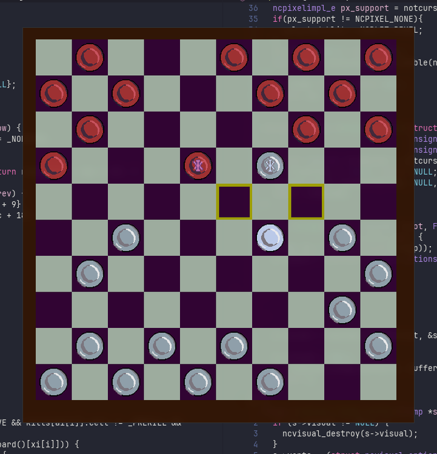
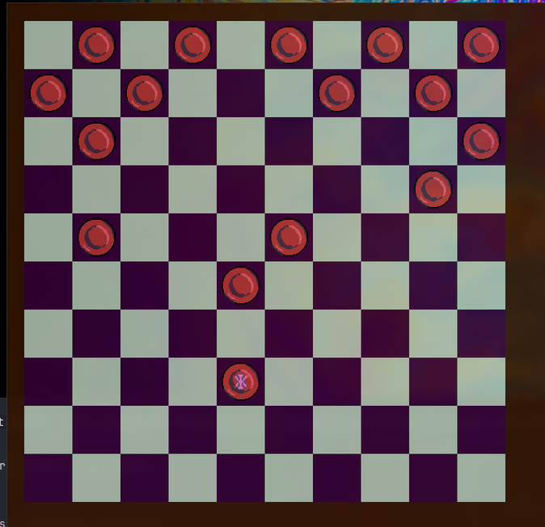

# Checkers-notcurses



This project is a terminal-based implementation of the game of checkers, built using notcurses for pixel-accurate rendering and mouse input.

The goal of the project is to explore interactive, graphical board games in the terminal while keeping the codebase simple and dependency-free apart from notcurses.

## Features

Fully playable checkers game in the terminal

Mouse-based controls 

Pixel-accurate rendering using notcurses

Minimal build system (Makefile)

## Requirements

A Unix-like system

A terminal supported by notcurses

**notcurses** (development headers and runtime, see [notcurses](https://github.com/dankamongmen/notcurses))

## Installation

Clone the repository and build the project:

```bash
git clone git@github.com:ArnaudValette/checkers-notcurses.git
cd checkers-notcurses
make
```


This produces the game executable in the repository root.

## Usage

Run the game with:

```bash
./game
```


All interactions are handled via the mouse.



## Notes

Terminal capabilities vary; for best results, use a modern terminal with good notcurses support.

The game follows weird checkers rules; rule variants are not currently configurable.

This project is intended as a technical and graphical experiment rather than a feature-complete game engine.
